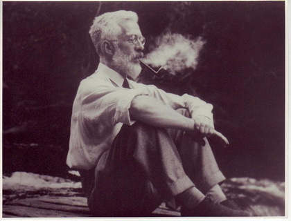

**Contexte ** 
Soient 5 étudiants (ou $k=5$ opérateurs) qui ont effectué chacun $n=20$ mesures avec le même moyen de mesure.

On cherche à savoir si la part de dispersion imputable au facteur "Opérateur" est significativement supérieure de la variabilité résiduelle (ou variance de répétabilité notée $\sigma_{r}^{2}$). Cette variabilité résiduelle ou variance intra-groupe est une erreur aléatoire, une erreur que le modèle n'explique pas.

Pour cela nous utiliserons la statistique $F$ due à Sir Ronald A. Fisher



Grossièrement cette statistique $F$ est le rapport de deux carrés moyens, le $CMF$ carré moyen dû aux facteurs et le $CMR$ carré moyen dû aux résidus :

\[ F=\frac{CMF}{CMR} \]

Pour le calcul du $CMF$,  on utilisera la somme des carrés des écarts de la moyenne d'un facteur par rapport à la moyenne totale. Il est évident que plus les facteurs ont des moyennes éloignées de la moyenne totale, plus le $CMF$ sera grand.

Le $CMR$ représente la variance au sein du groupe d'un même facteur. Pour son calcule, on sommera les carrés des écarts des données d'un groupe à la moyenne de ce groupe.

Ces deux carrés moyens ont approximativement la même valeur lorsque l'hypothèse nulle $H_{o}$ est vraie ($H_{o}$  affirme  qu'il n'y a pas de différence entre les moyennes des groupes), ce qui donne une valeur de $F$ proche de 1.

\[ \]

A présent mettons les mains dans le cambouis :

**1ère Etape** Mesurer les dispersions

On note :

$X_{ij}$ la $j^{\grave{e}me}$ mesure ($j=1...n$) de l'opérateur $i$ ($i=1...k$)

$\bar{X}=\frac{1}{N}\Sigma_{i}\Sigma_{j}X_{ij} \;\; (avec \; N=nk)$ la moyenne totale

$\bar{X_{i}}=\frac{1}{n}\Sigma_{j}X_{ij}$ la moyenne du facteur $i$


La dispersion totale notée **SCT** (somme des carrés totaux) se décompose donc en deux parties :

- Celle imputable aux facteurs (ici les opérateurs) que l'on notera **SCF** dite aussi **somme des carrés inter-classe**.

- Celle imputable aux résidus **SCR**, **somme des carrés intra-classes**.


$\begin{matrix}\sum_{i,j}(X_{ij}-\bar{X})^{2} &=&\sum_{i,j}(X_{ij}-\bar{X_{i}})^{2} &+& \sum_{i,j}  (\bar{X_{i}}-\bar{X})^{2} \\ SCT &=& SCR &+& SCF \\dispersion \;totale&=&somme\;des\; carr\acute{e}s\; intra-classes&+&somme\; des\; carr\acute{e}s \; inter-classes\end{matrix}$


**2ème Etape** Calcul des  variances factorielles et résiduelles


-Variance résiduelle : $CMR=\sigma_{r}^{2}=\frac{SCR}{N-k}$ ($N-k$ est le nombre de ddl)

-Variance Factorielle : $CMF=\frac{SCF}{k-1}$ (ici $k-1$ ddl)

Pour pouvoir comparer ces deux sommes nous les avons divisées par leurs degrés de liberté respectifs (intuitivement les degrés de liberté indiquent la quantité d'informations indépendantes entrant dans une estimation)


**3ème Etape** Test statistique

On détermine si la Variance Factorielle est significativement supérieure à la Variance résiduelle

On pose : $F_{k-1,N-k}=\frac{\frac{SCF}{k-1}}{\frac{SCR}{N-k}}$ cette statistique suit [la loi de Fisher](https://fr.wikipedia.org/wiki/Loi_de_Fisher), nous verrons plus loin que $F$ est le quotient de deux lois du $\chi^{2}$ à $k-1$ et $N-k$ ddl respectivement. Si $F$ est supérieure à la valeur seuil théorique selon la distribution de Fisher, avec un risque de 5%, alors le test sera significatif, donc la variabilité factorielle  est significativement supérieure de la variabilité résiduelle et on conclut que les facteurs sont différents.

\[ \]

Revenons à nos étudiants et Chargeons les données : (ils ont mesuré les 20 mêmes pièces avec le même instrument de mesure)
```{r}

donnees<-read.csv("https://sjaubert.github.io/SPCR/ANOVA_TP_R.csv",sep = ";",dec = ",",header = T)
donnees<-transform(donnees,Operateurs=as.factor(Operateurs))

Mesure=donnees$Mesure
Operateurs=donnees$Operateurs
```

En premier lieu, il est toujours utile de représenter les données pour se faire une première idée.

```{r warning=FALSE}
library(ggplot2)
ggplot(donnees, aes(y=Mesure, x=Operateurs,colour=Operateurs ,fill=Operateurs))+
geom_boxplot(alpha=0.5, outlier.alpha=0)+
geom_jitter(width=0.2)+
theme_classic()
```
A commenter...

Avant d'effectuer une ANOVA nous allons effectuer deux tests, Cochran puis Grubbs afin de voir s'il n'y a pas de valeurs abbérantes (voir [ici](http://www.demarcheiso17025.com/fiche017.html))

Commançons par vérifier à l'aide du test de Cochran si les variances sont homogènes ou si la variance la plus élevée est significativement différente des autres 


```{r}
library("outliers")
cochran.test(Mesure~Operateurs)
```

Au regard de la p-value nous pouvons considérer qu'il n'y a pas de variance aberrante

Utilisons à présent le test de Grubbs pour rechercher une éventuelle moyenne aberrante :
```{r}
(Moyennes<-tapply(Mesure,Operateurs,mean))

```

```{r}
grubbs.test(Moyennes)
```
Au regard de la p-value nous pouvons considérer qu'il n'y a pas de moyenne aberrante

On peut donc conserver toutes les données.

Mettons ces résultats en parallèle avec une ANOVA :
```{r}

res<-aov(Mesure ~ Operateurs)
res
summary(res)
```

Nous reconnaissons le $SCR=0.04024$ avec 95 ddl et le $SCF=0.00318$ avec 4 ddl

On a bien $F=\frac{\frac{SCF}{4}}{\frac{SCR}{95}}=1.875$ la probabilité d'obtenir une valeur de $F$ au moins aussi élevée, $P_{r}(F>1.875)=0.121$, est la p-value, ici elle est supérieure à 5%. On peut donc conclure qu'il n'y a pas de différence significative entre les opérateurs (une faible probabilité signifierait que nos données sont peu probable sous $H_{0}$)

\[ \]

```{r echo=TRUE, message=FALSE, warning=FALSE}
library(ggplot2)
x<-seq(from = 0,to = 4,by=0.005)
y<-df(x,4,95)
dataf<-data.frame(x=x,y=y)
p<-ggplot(dataf, aes(x=x, y=y),label="Densité de Fisher")
p+geom_line()+geom_area(color="blue", fill="grey", alpha=1/4) +geom_segment(aes(x = 1.875, y =0, xend = 1.875, yend = 0.1780),color = "red")+ ggtitle("Densité de Fisher df(x,4,95)")+geom_area(data=data.frame(value=x[376:801],dens=df(x[376:801],4,95)),aes(x=value, y=dens), fill="red")+geom_text(x=2.3, y=0.03, label="area=0.121")

```

```{r}
par(mfrow=c(2,2)) # permet de séparer la fenêtre graphique en 4 parties (2 lignes, et 2 colonnes)
plot(res)
```

- Le premier graphe nous montre que la valeur des résidus ne semble pas dépendre de l'opérateur

- Le deuxième graphe (quantile-quantile) nous montre que les résidus suivent bien une loi normale

- Le troisième graphe nous montre que les variances des différents groupes sont globalement identiques

- Dans le quatrième graphe nous ne voyons aucune preuve de valeurs aberrantes.


## Pour approfondir, quelques justifications :

Nous gardons les même notations que précédemment.

**Cherchons un estimateur de la variance de répétabilité**

$\begin{matrix} X_{ij} &=& \mu  & +& \alpha_{i} &+&\epsilon_{ij} \\  &  &  & &\uparrow && \uparrow \\  &  &  & &\textit{Effet de} \; l'op\acute{e}rateur \; i && R\acute{e}sidu \; de \;l'op\acute{e}rateur \; i \;sur \; la\; j\grave{e}me\; mesure\end{matrix}$

où $\epsilon_{ij}\hookrightarrow \mathcal{N}(0;\sigma_{r})$ avec $\sigma_{r} \;l'\acute{e}cart\;type\;de\;r\acute{e}p\acute{e}tabilit\acute{e}$ et $\alpha_{i}\hookrightarrow \mathcal{N}(0;\sigma_{o})$ avec $\sigma_{o} \;l'\acute{e}cart\;type\;du facteur \;op\acute{e}rateur$

On obtient :

$V(X_{ij})=\sigma_{o}^{2}+\sigma_{r}^{2}=\sigma_{R}^{2}$

$SCR=\sum_{i=1}^{k}\sum_{j=1}^{n}\epsilon_{ij}^{2}$ soit :

$\frac{SCR}{\sigma_{r}^{2}} =\sum_{i=1}^{k}\sum_{j=1}^{n}(\frac{\epsilon_{ij}}{\sigma_{r}})^{2}$ mais on sait que 

$\sum_{j=1}^{n}(\frac{\epsilon_{ij}}{\sigma_{r}})^{2}$ suit la loi du $\chi ^{2}$ à $n-1$ ddl alors $\frac{SCR}{\sigma_{r}^{2}}\hookrightarrow \chi ^{2}(k(n-1))$ d'où 

$\mathbb{E}(\frac{SCR}{\sigma_{r}^{2}})=nk-k=N-k\Leftrightarrow \mathbb{E}(\frac{SCR}{N-k})=\sigma_{r}^{2}$

$\frac{SCR}{N-k}$ est un estimateur sans biais de $\sigma_{r}^{2}$

**Cherchons à présent un estimateur de la variance de reproductibilité**

On a vu que :

$SCF=\sum_{i,j}  (\bar{X_{i}}-\bar{X})^{2}=n\sum_{i=1}^{k}  (\bar{X_{i}}-\bar{X})^{2}$ et $\bar{X_{i}}=\frac{1}{n}\Sigma_{j}X_{ij}=\frac{1}{n}\Sigma_{j}(\mu+\alpha_{i}+\epsilon_{ij})$

$\bar{X_{i}}=\mu+\alpha_{i}+\frac{1}{n}\Sigma_{j}\epsilon_{ij}$

$V(\bar{X_{i}})=V(\alpha_{i})+\frac{1}{n^{2}}\Sigma_{j}V(\epsilon_{ij})$

$V(\bar{X_{i}})=\sigma_{o}^{2}+\frac{1}{n}\sigma_{r}^{2}$ d'où

$\frac{SCF}{V(\bar{X_{i}})}=n\sum_{i=1}^{k}  \left (\frac{\bar{X_{i}}-\bar{X}}{\sqrt{V(\bar{X_{i}})}} \right )^{2}$

$\mathbb{E}(\frac{SCF}{V(\bar{X_{i}})})=n(k-1)\Leftrightarrow\mathbb{E}(SCF)=n(k-1)V(\bar{X_{i}})$

Soit :
$\mathbb{E}(\frac{SCF}{k-1})=nV(\bar{X_{i}})=n(\sigma_{o}^{2}+\frac{1}{n}\sigma_{r}^{2})=n\sigma_{o}^{2}+\sigma_{r}^{2}$

on pose enfin $CMF=\frac{SCF}{k-1}$ et  $CMR=\frac{SCR}{N-k}$ 

et ainsi on calcule la statistique de Fisher  $F_{k-1,N-k}=\frac{\frac{SCF}{k-1}}{\frac{SCR}{N-k}}$


```{r eval=FALSE, include=FALSE}
*Remarques :*
  
$\mathbb{E}(\frac{CMF-CMR}{n})=\sigma_{o}^{2}$ et comme $\sigma_{R}^{2}=\sigma_{o}^{2}+\sigma_{r}^{2}$

$\mathbb{E}(\frac{CMF-CMR}{n})+CMR=\sigma_{R}^{2}$

On calcule ainsi le $\sigma_{R\&R}$

   \[ \sigma_{R\&R}^{2}=\sigma_{R}^{2}+\sigma_{r}^{2} \] (ça sera le sujet d'une autre étude...)
  
```


